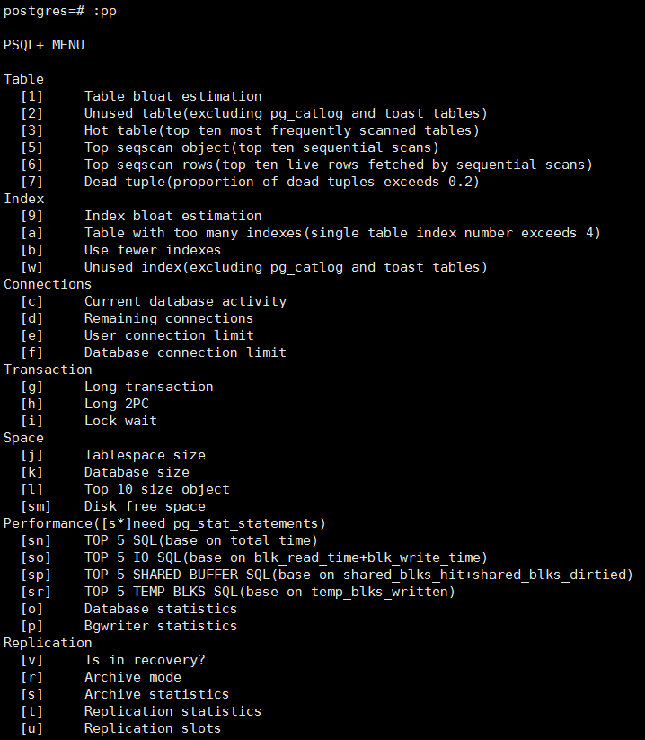
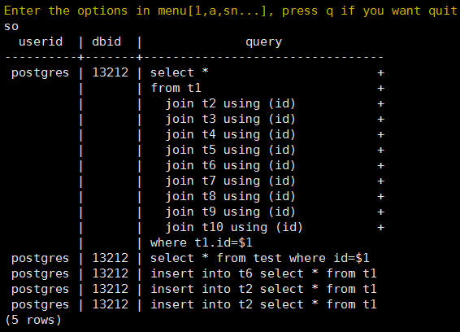
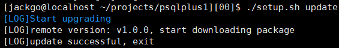

[](https://raw.githubusercontent.com/postgrespro/pg_pathman/master/LICENSE)
# PsqlPlus

`PsqlPlus` provides common operation and maintenance sql for the postgresql and supports user-defined options. PsqlPlus which does **not** change any server files, is implemented as an extension of the psql. It's easy to install and use.

SQLs are collected from internet, most of which from [digoal's blog](https://github.com/digoal/blog). The first line of each src/*.sql indicates its source.



The extension is compatible with:

 * PostgreSQL 10+;


## Installation guide

Remote installation is recommended.

### Remote installation

To install `psqlplus`, execute the following commands in any directory:

```shell
mkdir psqlplus && cd psqlplus
wget -q https://raw.githubusercontent.com/mutex73/psqlplus/master/setup.sh && sh setup.sh install
```

### Local installation

```shell
git clone git@github.com:mutex73/psqlplus.git
cd psqlplus
chmod u+x setup.sh 
./setup.sh install
# ./setup -h see some help
```

## Usage

### Connect to the postgresql using psql

>  Do not passed an `-X` option to psql

```shell
psql [option...] [dbname [username]]
```

### Enter **:pp** to start psqlplus

```sql
postgres=# :pp
PSQL+ MENU             

Table
  [1]     Table bloat estimation
...
Performance([s*]need pg_stat_statements)
  [sn]    TOP 5 SQL(base on total_time)
  [so]    TOP 5 IO SQL(base on blk_read_time+blk_write_time)
  [sp]    TOP 5 SHARED BUFFER SQL(base on shared_blks_hit+shared_blks_dirtied)
...
Enter the options in menu[1,2,3...], press q if you want quit
```

### Enter your option

Press 'so' to check out TOP 5 IO SQL.



```
Enter the options in menu[1,2,3...], press q if you want quit
so
  userid  | dbid  |              query              
----------+-------+---------------------------------
 postgres | 13212 | select *                       +
          |       | from t1                        +
          |       |   join t2 using (id)           +
          |       |   join t3 using (id)           +
          |       |   join t4 using (id)           +
          |       |   join t5 using (id)           +
          |       |   join t6 using (id)           +
          |       |   join t7 using (id)           +
          |       |   join t8 using (id)           +
          |       |   join t9 using (id)           +
          |       |   join t10 using (id)          +
          |       | where t1.id=$1
 postgres | 13212 | select * from test where id=$1
 postgres | 13212 | insert into t6 select * from t1
 postgres | 13212 | insert into t2 select * from t1
 postgres | 13212 | insert into t2 select * from t1
(5 rows)
```

**Tips: press q if you want to quit.**

## How to update

psqlplus automatically queries the latest version and downloads if applicable.

```shell
./setup.sh update
```



## How to uninstall

- delete `\set pp '\\i /home/pathto/psqlplus.psql'`in $HOME/.pslqrc file 
- `rm -rf psqlplus`

## Feedback

Do not hesitate to post your issues, questions and new ideas at the [issues](https://github.com/mutex73/psqlplus/issues) page.

## Authors

Gaomingjie <jackgo73(at)outlook.com> ?., China

Liuliang <biaoxyzll(at)gmail.com> ?., China